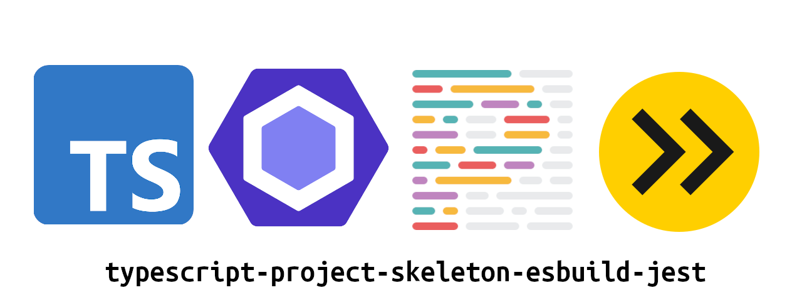

# package-skeleton

---

<!-- ==START TEMPLATE README== -->

<p align="center">
    
</p>

## Description

This repository is a starter template for NodeJS projects using the latest versions of TypeScript, ESBuild, ESLint, Prettier, and Jest. Use it to create NPM packages, CLI applications, and more.

It also optionally uses [Madge](https://github.com/pahen/madge) to visualize connections between classes and files within your project.

Want to use `.env` files in your project? This will configure it automatically, if you want it to.

Want to use a configuration file in your project? This will configure it automatically, too, if you ask it to.

## Template Setup

To configure, run:

```bash
node configure-package.js
```

The configure script will ask you a series of questions that will customize the template with values such as your name, GitHub username, email address, use of optional packages, and more.

Some of the default values are automatically determined based on your git configuration, but you may change any of the values when prompted.

<!-- ==END TEMPLATE README== -->

{{package.description}}

## Setup

```bash
npm install

npm run dev
```

## Testing

`package-skeleton` uses Jest for unit tests. To run the test suite:

`npm run test`

---

## Changelog

Please see [CHANGELOG](CHANGELOG.md) for more information on what has changed recently.

## Contributing

Please see [CONTRIBUTING](.github/CONTRIBUTING.md) for details.

## Security Vulnerabilities

Please review [our security policy](../../security/policy) on how to report security vulnerabilities.

## Credits

-   [{{package.author.name}}](https://github.com/{{package.author.github}})
-   [All Contributors](../../contributors)

## License

The MIT License (MIT). Please see [License File](LICENSE) for more information.
